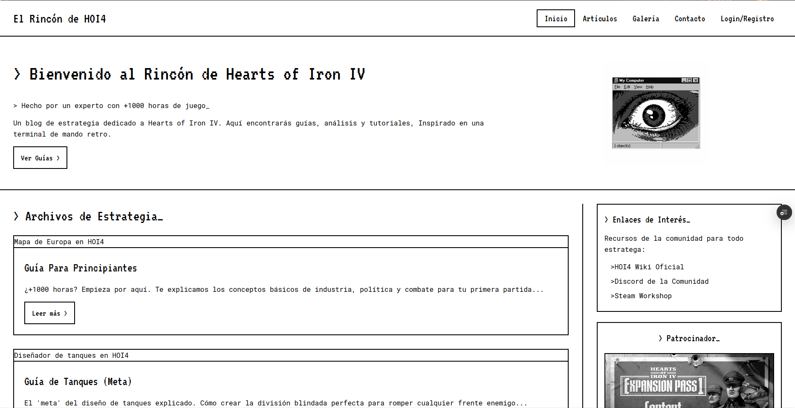

# 🚀 El Rincón de Herson (Blog HOI4)


Este repositorio contiene el proyecto de un blog multi-página y responsive sobre el videojuego de estrategia **Hearts of Iron IV (HOI4)**. El proyecto fue desarrollado como entrega para una asignatura de desarrollo web, cumpliendo con un conjunto de requisitos específicos de maquetación.

El diseño está inspirado en una estética retro de "terminal de mando" en blanco y negro, utilizando tipografías pixeladas (`VT323`) y monoespaciadas (`Roboto Mono`).

## 📸 Vista Previa

(Te recomiendo que hagas una captura de pantalla de tu `index.html` y la subas a la carpeta `img/`. Luego, cambia el nombre de abajo para que coincida).



---

## 📋 Contexto del Proyecto

El objetivo era diseñar y maquetar un blog responsive sobre una temática propia usando **solo HTML y CSS**. El sitio debía ser multi-página y cumplir con una serie de requisitos funcionales y de contenido.

## ✨ Características Principales

* **100% Responsive:** Totalmente funcional y estilizado para móvil, tablet y escritorio usando Flexbox y CSS Grid.
* **HTML Semántico:** Estructurado con etiquetas semánticas de HTML5 (`<header>`, `<main>`, `<aside>`, `<article>`, `<footer>`).
* **Componentes Reutilizables:** La cabecera, el pie de página y el sidebar (con info de autor, enlaces y anuncio) son consistentes en todas las páginas.
* **Páginas de Formularios:** Se maquetaron 3 formularios (`login`, `registro`, `contacto`) con un estilo retro y foco visible.
* **Efectos CSS:** Uso de filtros CSS (`grayscale`) para mantener la estética B/N y dar interactividad a las imágenes.
* **Contenido Real:** 5 entradas de blog detalladas sobre guías de HOI4.

---

## 🛠️ Stack Tecnológico

Este proyecto se construyó exclusivamente con:

* **HTML5:** Para la estructura y el contenido.
* **CSS3:** Para todo el estilo, el layout (Flexbox/Grid) y el responsive (Media Queries).

No se utilizó ningún framework (como Bootstrap) ni JavaScript.

---

## 📁 Estructura del Proyecto

La estructura de carpetas del proyecto es la siguiente:

```
/
├── index.html          (Página de inicio o "landing page")
├── css/
│   └── estilos.css     (Hoja de estilos única)
├── img/
│   ├── (imágenes del sidebar, anuncio, avatar, etc.)
│   └── galeria/
│       └── (imágenes de la galería y de las "cards" de artículos)
├── html/
│   ├── articulos.html  (Página que lista todos los artículos)
│   ├── galeria.html
│   ├── login.html
│   ├── registro.html
│   └── contacto.html
└── articulos/
    ├── articulo-principiantes.html
    ├── articulo-tanques.html
    ├── articulo-barcos.html
    ├── articulo-aviones.html
    └── articulo-estrategia.html
```

---

## 🤖 Nota sobre el Desarrollo (Colaboración con IA)

Este proyecto se desarrolló como un ejercicio práctico de maquetación web. Para acelerar el proceso, generar contenido de alta calidad para las guías y refinar la estructura del CSS, **se contó con la asistencia de una Inteligencia Artificial (Gemini de Google)**.

La IA actuó como un "programador experto" y asistente de contenido, ayudando a:
* Traducir la inspiración visual (la imagen del diseño retro) en código CSS funcional.
* Escribir el contenido de las 5 guías de HOI4 basándose en guías reales (PDFs y vídeos).
* Refactorizar y limpiar el CSS para agrupar las Media Queries y mejorar la flexibilidad del layout.
* Adaptar y corregir todas las rutas de archivos (`href`, `src`) para que coincidieran con la estructura final del repositorio.

Todo el proceso fue **dirigido y validado por el autor** para asegurar que se cumplieran todos los requisitos del proyecto.
